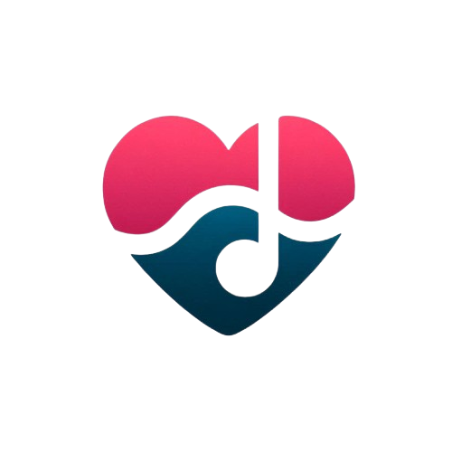

# Fitmo 🏋️🎵

<div align="center">
  
  <br>
  <h3>Sua jornada fitness com a trilha sonora perfeita</h3>
  
  
  
  
  
  
</div>

## 📱 O que é o Fitmo?

O **Fitmo** é um aplicativo de fitness exclusivo para Android que combina treinos personalizados com uma experiência musical integrada. Projetado para transformar sua rotina de exercícios em momentos motivadores e envolventes, o Fitmo oferece:

- Interface intuitiva com tema claro e escuro
- Treinos personalizados baseados em seus objetivos
- Player de música integrado para seus treinos
- Acompanhamento de progresso e histórico de atividades
- Perfil personalizado com suas informações e metas

## 📽️ Video de demonstração

- Link: https://www.youtube.com/shorts/SSY-fUPdnfc

## ✨ Recursos Principais

### Player de Música Integrado
- Reproduza suas músicas favoritas durante os treinos
- Interface moderna e intuitiva
- Controles de reprodução completos

### Acompanhamento de Progresso
- Histórico completo de atividades
- Estatísticas de desempenho
- Visualização gráfica de evolução
- Acompanhamento de métricas importantes

### Personalização Avançada
- Configurações de perfil detalhadas
- Preferências de treino customizáveis
- Objetivos fitness personalizados
- Adaptação contínua baseada no progresso

## 🛠️ Tecnologias Utilizadas

- **Frontend**: Flutter (Dart)
- **Armazenamento**: Hive (banco de dados local)
- **Gerenciamento de Estado**: Provider
- **Áudio**: just_audio, AudioPlayers
- **UI/UX**: Material Design 3 com tema personalizado
- **Versionamento**: Git & GitHub

## 📂 Estrutura do Projeto

```
fitmo/
├── lib/
│   ├── main.dart           # Ponto de entrada do aplicativo
│   ├── providers/          # Gerenciamento de estado
│   ├── models/             # Modelos de dados
│   ├── screens/            # Telas da interface
│   ├── widgets/            # Componentes reutilizáveis
│   └── utils/              # Funções utilitárias
├── assets/
│   ├── images/             # Imagens e ícones
│   ├── fonts/              # Fontes personalizadas
│   └── audio/              # Arquivos de áudio para testes
└── test/                   # Testes unitários e de interface
```

## 🚀 Como Executar o Projeto

### Requisitos do Sistema
- Flutter SDK (versão 3.13.0 ou superior)
- Android Studio com extensões Flutter/Dart
- Android SDK (API level 21+/Android 5.0 Lollipop ou superior)
- Dispositivo Android físico ou emulador

### Download Direto do APK
Se você deseja apenas instalar e usar o aplicativo sem configurar o ambiente de desenvolvimento, você pode baixar o APK diretamente na seção "Releases".

### Passo a Passo
1. **Clone o repositório**
   ```bash
   git clone https://github.com/seu-usuario/fitmo.git
   cd fitmo
   ```

2. **Instale as dependências**
   ```bash
   flutter pub get
   ```

3. **Execute o aplicativo**
   ```bash
   flutter run
   ```

4. **Para build de produção**
   ```bash
   flutter build apk --release
   ```

## 🌗 Tema Claro e Escuro

O Fitmo oferece suporte completo a temas claro e escuro, adaptando-se às preferências do usuário e condições de iluminação:

- **Tema Escuro**: Ideal para treinos noturnos e economia de bateria
- **Tema Claro**: Perfeito para ambientes externos e boa visibilidade diurna

## 📱 Compatibilidade com Android

O Fitmo é otimizado para funcionar na maioria dos dispositivos Android:

- **Versão mínima**: Android 5.0 (Lollipop) / API Level 21
- **Versão recomendada**: Android 10.0 ou superior
- **Suporte a tablets**: Layout adaptativo para telas maiores

## 👥 Equipe

- **LUIZ FERNANDO COSTA DA SILVA**
- **LUIZ GUSTAVO OLIVEIRA DE LIMA**
- **GABRIEL ROSA NEGREIROS DIAS**
- **VICTOR SILVA DE ANDRADE**
- **THIAGO VIEIRA NOBRE**

## 📊 Roadmap

### Ideias Futuras
- [ ] Integração com serviços de streaming de música (Spotify, YouTube Music)
- [ ] Criação de Playlists para cada treino
- [ ] Conexão com dispositivos wearables Android (WearOS, monitores cardíacos)
- [ ] Estatísticas avançadas e gráficos de progressão
- [ ] Modo de treino offline com download de playlists
- [ ] Widgets para tela inicial Android
- [ ] Integração com Google Fit

## 📄 Licença

Este projeto está licenciado sob a **MIT License** - consulte o arquivo [LICENSE](LICENSE) para detalhes.

## 🙌 Agradecimentos

- Ao orientador **Gustavo Calixto** pelo suporte técnico e mentoria
- Ao Senac pela infraestrutura e oportunidades de aprendizado
- À comunidade Flutter pelo ecossistema robusto

---

<div align="center">
  <p>Desenvolvido como parte do Projeto Integrador do curso de Análise e Desenvolvimento de Sistemas do Senac.</p>
  <p>🌟 <b>Transforme seus treinos com o Fitmo!</b> 🌟</p>
</div>
